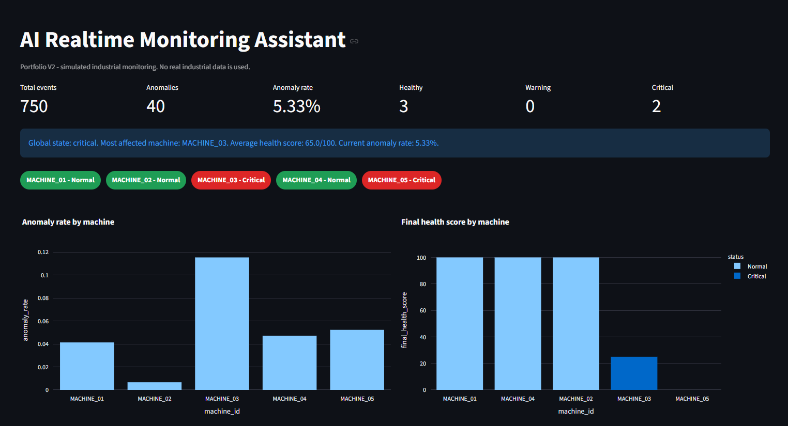
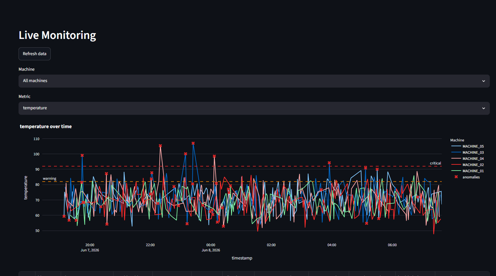
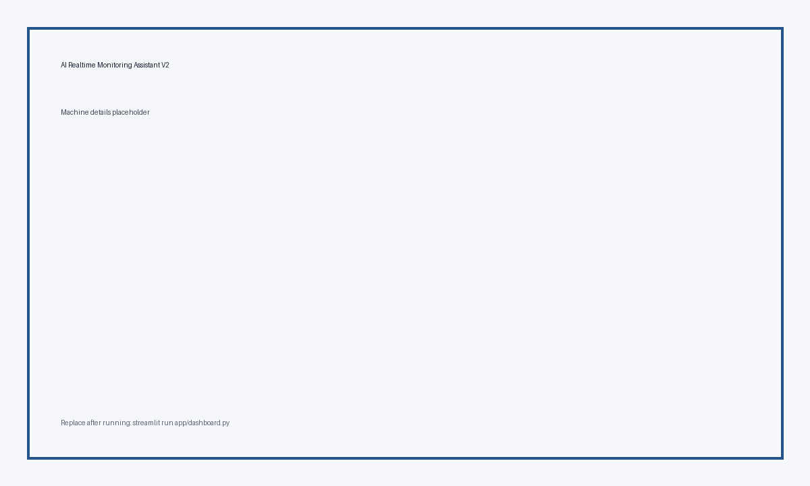
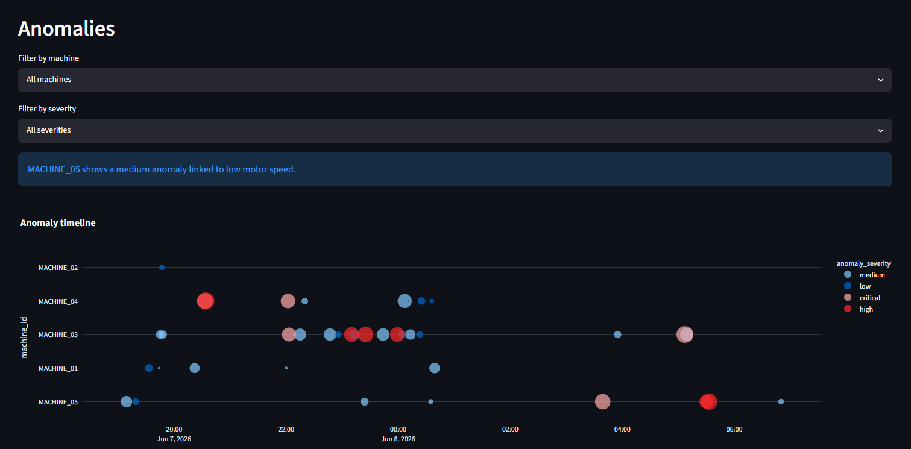

# AI Realtime Monitoring Assistant

AI Realtime Monitoring Assistant is a portfolio project simulating industrial equipment monitoring and anomaly detection.

The system combines:

- streaming data processing
- anomaly detection with Isolation Forest
- health scoring
- explainable diagnostics
- FastAPI services
- SQLite persistence
- Streamlit visualization

The goal is to demonstrate a realistic end-to-end monitoring architecture that can be used as a foundation for predictive maintenance and industrial monitoring applications.

> All industrial data used in this project is simulated.
> This repository is intended for educational and portfolio purposes.

## Table of Contents

- [Business Use Case](#business-use-case)
- [Project Highlights](#project-highlights)
- [Dashboard Preview](#dashboard-preview)
- [Demonstration Scenario](#demonstration-scenario)
- [Architecture Overview](#architecture-overview)
- [Key Features](#key-features)
- [Key Skills Demonstrated](#key-skills-demonstrated)
- [Why This Project Matters](#why-this-project-matters)
- [What This Project Demonstrates](#what-this-project-demonstrates)
- [Tech Stack](#tech-stack)
- [Project Structure](#project-structure)
- [Data Simulation](#data-simulation)
- [How Pathway Is Used](#how-pathway-is-used)
- [Machine Learning Approach](#machine-learning-approach)
- [AI Agent](#ai-agent)
- [API Documentation](#api-documentation)
- [Dashboard](#dashboard)
- [Installation](#installation)
- [Run Locally](#run-locally)
- [Run with Docker](#run-with-docker)
- [Tests](#tests)
- [Limitations](#limitations)
- [Future Improvements](#future-improvements)
- [CV Pitch](#cv-pitch)

## Business Use Case

Industrial teams need to monitor equipment signals such as temperature, pressure, vibration, energy consumption, and motor speed to detect early signs of degradation.

This project simulates that context with five industrial machines and shows how an AI/Data engineer can build a complete monitoring assistant: from data generation and streaming ingestion to anomaly detection, storage, API exposure, dashboard visualization, and AI-assisted diagnostics.

The project is intentionally realistic without pretending to use real industrial data.

## Project Highlights

- 5 monitored machines: `MACHINE_01` to `MACHINE_05`
- 10,000+ simulated historical sensor records
- Multiple operating modes: `idle`, `normal`, `high_load`, `maintenance`
- Continuous-style sensor stream simulation
- Pathway pipeline for streaming data processing
- Feature engineering for sensor deltas, ratios, and rolling statistics
- Isolation Forest anomaly detection
- Multi-level anomaly severity: `low`, `medium`, `high`, `critical`
- Final machine health scoring based on both sensor state and recent anomaly penalty
- Root cause analysis with probable cause, confidence score, and recommendation
- SQLite persistence layer for events, anomalies, and reports
- REST API with FastAPI and Swagger documentation
- Interactive Streamlit dashboard
- Pytest test suite and GitHub Actions workflow

## Dashboard Preview

### Overview



The Overview page presents the global state of the simulated monitoring system. The screenshot shows 750 total events, 40 detected anomalies, and an anomaly rate of 5.33%. It also summarizes machine status with 3 healthy machines, 0 warning machines, and 2 critical machines.

A blue system summary banner identifies the global state as critical, highlights `MACHINE_03` as the most affected machine, and reports an average health score of 65.0/100. The machine status indicators make the situation readable immediately: `MACHINE_01`, `MACHINE_02`, and `MACHINE_04` are green and normal, while `MACHINE_03` and `MACHINE_05` are red and critical.

The two charts below support the operational diagnosis. The anomaly rate by machine shows that `MACHINE_03` has the highest anomaly rate, while the final health score chart shows that `MACHINE_03` and `MACHINE_05` have degraded health compared with the other machines.

### Live Monitoring



The Live Monitoring page provides a time-series view of sensor behavior. The screenshot displays controls to refresh the data, filter by machine, and select the monitored metric. The selected metric is `temperature`, with all machines displayed together.

The chart shows temperature over time for all five machines, with warning and critical threshold lines visible across the plot. Red anomaly markers appear directly on top of the time series, making it possible to connect abnormal events with signal spikes or unusual drops. This creates a real-time monitoring style workflow where an operator can compare machine trends, inspect threshold crossings, and identify periods where anomalies cluster.

### Machine Details



The Machine Details page focuses on one selected machine. In the screenshot, `MACHINE_02` is shown as `Normal`, with a final health score of 100.0/100 and a low risk level.

The diagnostic cards separate raw sensor condition from anomaly history. The page displays sensor health at 100.0/100, anomaly penalty at 0, and 0 recent anomalies. This makes the status coherent: the machine is normal because both the latest sensor state and recent anomaly history are healthy.

The root cause panel still provides a structured diagnostic output. It shows a probable cause of `Multivariate Pattern Drift`, a 62% confidence score, and the recommendation to review recent sensor history and validate sensor calibration. The sensor diagnostics cards show temperature, pressure, vibration, power, and speed values with warning and critical thresholds, allowing a reviewer to understand why the machine is not currently in alert.

### Anomaly Analysis



The Anomaly Analysis page supports investigation and prioritization. The screenshot shows filters for machine and severity, followed by an automatic explanation: `MACHINE_05` has a medium anomaly linked to low motor speed.

The anomaly timeline plots events by timestamp and machine, with severity levels encoded by color and marker size. Medium, low, critical, and high anomalies are visible across several machines. This helps identify which machines have isolated anomalies and which machines show repeated or severe incidents. The visualization makes the investigation workflow clearer: filter the anomaly set, read the generated explanation, then inspect the timeline to prioritize the machines requiring attention.

## Demonstration Scenario

Use this workflow for a 5-minute recruiter or interview demonstration:

1. Generate demo data with the bootstrap command.
2. Simulate industrial sensor streams.
3. Process incoming events through the Pathway pipeline.
4. Detect anomalies with the trained Isolation Forest model.
5. Store sensor events, anomalies, and reports in SQLite.
6. Visualize the system status in the Streamlit dashboard.
7. Investigate affected machines using the Machine Details and Anomalies pages.
8. Query the AI assistant to explain alerts and recommend actions.
9. Export monitoring reports for follow-up analysis.

## Architecture Overview

```text
Industrial Sensors (Simulated)
            |
            v
     Data Generator
            |
            v
   Streaming Simulator
            |
            v
         Pathway
            |
            v
   Feature Engineering
            |
            v
    Isolation Forest
            |
            v
          SQLite
       /          \
      v            v
   FastAPI     Streamlit
                    |
                    v
             AI Assistant
```

Component roles:

- `Data Generator` creates historical simulated sensor data for five machines.
- `Streaming Simulator` writes new sensor events to the stream folder to mimic continuous ingestion.
- `Pathway` reads incoming stream files, applies transformations, and computes a health index.
- `Feature Engineering` adds deltas, ratios, and rolling statistics used by the anomaly detector.
- `Isolation Forest` detects abnormal operating patterns and produces anomaly scores.
- `SQLite` stores sensor events, detected anomalies, and generated reports.
- `FastAPI` exposes monitoring metrics, machine status, anomaly history, and assistant endpoints.
- `Streamlit` provides the operational dashboard used for investigation and reporting.
- `AI Assistant` explains anomalies, estimates risk, and recommends technical actions using a robust local fallback.

More technical details are available in [docs/architecture.md](docs/architecture.md).

## Key Features

- One-command demo bootstrap with `python -m app.bootstrap_demo`
- Streamlit V2 dashboard with Overview, Live Monitoring, Machine Details, Anomalies, AI Assistant, Reports, and Project Info pages
- Historical data generation with realistic operating modes and injected anomalies
- Continuous stream simulator writing append-only CSV events
- Pathway pipeline for streaming ingestion and transformation
- Health scoring that combines latest sensor state and recent anomaly penalty
- Isolation Forest anomaly detection with saved scaler/model artifact
- SQLite storage for events, anomalies, and reports
- FastAPI endpoints with Swagger documentation
- Rule-based AI assistant that explains recent anomalies and recommends actions
- Pytest coverage for data generation, model behavior, reports, and API endpoints
- Docker and Docker Compose support
- GitHub Actions test workflow

## Key Skills Demonstrated

Technical skills demonstrated by this project:

### Data Engineering

- Data generation
- Streaming simulation
- ETL concepts
- SQLite persistence

### Machine Learning

- Isolation Forest
- Feature Engineering
- Anomaly Detection
- Evaluation Metrics

### Software Engineering

- FastAPI
- Streamlit
- Docker
- Testing
- GitHub Actions

### Monitoring Systems

- Health Scoring
- Alerting
- Diagnostic Workflows
- Monitoring Dashboards

### Explainable AI

- Root Cause Analysis
- Diagnostic Recommendations
- Risk Assessment

## Why This Project Matters

Industrial monitoring and predictive maintenance rely on the ability to detect weak signals before a machine failure becomes expensive or dangerous. This project demonstrates the core ideas behind those systems in a controlled simulated environment.

It connects anomaly detection with a practical monitoring workflow: incoming sensor data is processed, scored, stored, visualized, and explained. The dashboard is not just a charting layer; it supports investigation through machine-level status, anomaly severity, timeline analysis, root cause hypotheses, and recommended actions.

For manufacturing, energy, healthcare equipment, automotive, and industrial maintenance contexts, this type of architecture is a credible foundation for AI-driven diagnostics.

## What This Project Demonstrates

This project demonstrates practical experience with:

- end-to-end ML pipelines
- anomaly detection systems
- data engineering
- monitoring architectures
- API development
- dashboard development
- explainable AI concepts

the value of the project is that it connects multiple skills into one coherent product-like prototype. It shows the ability to structure data flows, train and use a model, expose results through an API, create an operator-facing dashboard, document limitations honestly, and keep the system runnable on a local Windows machine.

## Tech Stack

- Python 3.10+
- Pathway
- pandas
- numpy
- scikit-learn
- FastAPI
- Uvicorn
- Streamlit
- SQLite
- Plotly and matplotlib
- joblib
- pytest
- Docker
- python-dotenv

## Project Structure

```text
ai-realtime-monitoring-assistant/
|-- app/
|   |-- config.py
|   |-- data_generator.py
|   |-- streaming_simulator.py
|   |-- pathway_pipeline.py
|   |-- preprocessing.py
|   |-- anomaly_detector.py
|   |-- database.py
|   |-- report_generator.py
|   |-- agent.py
|   |-- api.py
|   |-- dashboard.py
|   `-- root_cause.py
|-- data/
|-- models/
|-- notebooks/
|-- tests/
|-- docs/
|   |-- architecture.md
|   |-- cv_pitch.md
|   `-- screenshots/
|       |-- overview.png
|       |-- live_monitoring.png
|       |-- machine_details.png
|       `-- anomaly_analysis.png
|-- README.md
|-- requirements.txt
|-- Dockerfile
|-- docker-compose.yml
|-- .env.example
`-- .gitignore
```

## Data Simulation

The project simulates five machines:

- `MACHINE_01`
- `MACHINE_02`
- `MACHINE_03`
- `MACHINE_04`
- `MACHINE_05`

Operating modes:

- `idle`
- `normal`
- `high_load`
- `maintenance`

Sensor features:

- `temperature`
- `pressure`
- `vibration`
- `power_consumption`
- `motor_speed`

The historical generator creates at least 10,000 rows and injects around 5 percent anomalies such as overheating, high vibration, high pressure, excessive power consumption, motor speed drop, and multi-signal degradation.

## How Pathway Is Used

`app/pathway_pipeline.py` defines a Pathway schema for incoming sensor events, reads CSV events from `data/stream/` in streaming mode, selects useful columns, computes a `health_index`, and writes processed rows to `data/processed/stream_processed.csv`.

Pathway is used for actual pipeline definition and execution when the real Pathway runtime is available. On Windows, the installed `pathway` package may expose a platform stub instead of the real engine; in that case the module falls back to a one-shot pandas processor so the rest of the prototype remains runnable. Docker/Linux is the recommended environment for demonstrating the continuous Pathway runtime.

## Machine Learning Approach

The anomaly model uses `IsolationForest` from scikit-learn. Numeric features are standardized with `StandardScaler`, and the scaler is saved together with the model in `models/anomaly_model.pkl`.

V2 adds feature engineering:

- `temperature_delta`
- `vibration_delta`
- `power_ratio`
- `pressure_ratio`
- `rolling_mean_temperature`
- `rolling_mean_vibration`
- `rolling_std_temperature`
- `rolling_std_vibration`

The final severity combines:

- Isolation Forest anomaly score
- business thresholds for temperature, pressure, vibration, power consumption, and motor speed
- operating-mode-aware thresholds
- optional health index when available

Severity levels:

- `normal`
- `low`
- `medium`
- `high`
- `critical`

When simulated labels are available, training also writes `models/evaluation_metrics.json` with precision, recall, and F1-score.

Current simulated-label evaluation after `python -m app.bootstrap_demo`:

- Precision: 0.6385
- Recall: 0.8127
- F1-score: 0.7152
- Evaluated rows: 10,000

## AI Agent

The V2 assistant is rule-based and robust without an API key. It exposes structured tools internally:

- `get_latest_anomalies`
- `get_machine_status`
- `get_machine_history`
- `get_global_metrics`
- `generate_report`

It reads SQLite anomalies, identifies likely signal drivers, returns a risk level, explains why a machine is in alert, and recommends a technical action.

The code is structured for future LangGraph integration through tool-like functions and a dedicated rewrite extension point. If `OPENAI_API_KEY` is absent, the local deterministic fallback is used.

## API Documentation

Run:

```powershell
uvicorn app.api:app --reload
```

Open:

```text
http://127.0.0.1:8000/docs
```

Endpoints:

- `GET /`
- `GET /health`
- `GET /metrics`
- `GET /dashboard/summary`
- `GET /events/latest`
- `GET /anomalies/latest`
- `GET /anomalies/{machine_id}`
- `GET /machines`
- `GET /machines/{machine_id}/status`
- `GET /machines/{machine_id}/history`
- `GET /report`
- `POST /agent/query`

Example agent request:

```json
{
  "question": "Pourquoi MACHINE_03 est en alerte ?"
}
```

## Dashboard

Run:

```powershell
streamlit run app/dashboard.py
```

Sections:

- Overview
- Live Monitoring
- Machine Details
- Anomalies
- AI Assistant
- Reports
- Project Info

The dashboard reads SQLite directly for simplicity and reliability. It is designed to be understandable in a recruiter demonstration while still reflecting realistic monitoring concepts: status indicators, threshold-aware charts, machine diagnostics, anomaly timelines, and explainable recommendations.

## Installation

```powershell
python -m venv venv
venv\Scripts\activate
pip install -r requirements.txt
```

## Run Locally

Initialize data, train the model, prepare SQLite, detect anomalies, and generate a report:

```powershell
python -m app.bootstrap_demo
```

Manual initialization is still available:

```powershell
python -m app.data_generator
python -m app.anomaly_detector --train
python -m app.database
```

Launch the stream simulator:

```powershell
python -m app.streaming_simulator
```

Launch the Pathway pipeline in another terminal:

```powershell
python -m app.pathway_pipeline
```

Run anomaly prediction on processed stream data:

```powershell
python -m app.anomaly_detector --predict
```

Launch the API:

```powershell
uvicorn app.api:app --reload
```

Launch the dashboard:

```powershell
streamlit run app/dashboard.py
```

## Run with Docker

Build and run the dashboard:

```powershell
docker build -t ai-realtime-monitoring-assistant .
docker run -p 8501:8501 ai-realtime-monitoring-assistant
```

Run API and dashboard:

```powershell
docker compose up --build
```

## Tests

```powershell
pytest
```

Expected local result:

```text
6 passed
```

## Limitations

- All data is simulated.
- The project is a prototype and is not production-ready.
- Thresholds are illustrative and not calibrated on real equipment.
- The model is unsupervised and should be validated against expert labels before real deployment.
- The assistant uses a deterministic rule-based fallback unless an LLM integration is added later.
- The Pathway runtime may require Linux/Docker for the strongest continuous streaming demonstration.

## Future Improvements

- Add LangGraph orchestration for the assistant.
- Store stream output directly in SQLite from the processing layer.
- Add model monitoring and drift detection.
- Add richer sensor profiles per machine type.
- Add authentication and production-grade observability for the API.
- Add experiment tracking for model versions and threshold calibration.


## GitHub Setup

```powershell
git init
git branch -M main
git add .
git commit -m "Initial commit: AI realtime monitoring assistant"
git remote add origin git@github.com:TON_USERNAME/ai-realtime-monitoring-assistant.git
git push -u origin main
```
